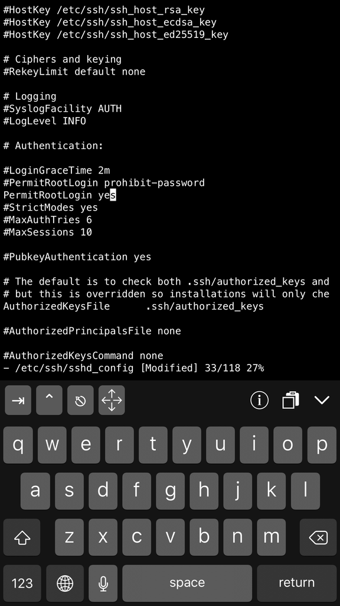

# 在 iOS 裝置上執行 Linux shell 環境

---

## 前言

因為一位朋友的介紹，最近對在手機上運作 Linux 很著迷。雖然也不知道運作後要幹嘛就是了 XD

這類的 App 在 Android 上比較多，但除非你的裝置有 root 過，否則使用一些系統資源時會遭遇限制。

前幾天無聊試著在 Apple App Store 上打關鍵字，結果看到一個有趣的 App -- iSH


[](https://apps.apple.com/us/app/ish-shell/id1436902243)

iSH 的官網在[這邊](https://ish.app/)，網站上的標題就告訴你 "The Linux shell for iOS." 感覺可以玩看看。


## 官方資源 


這類的東西其實非常冷門，沒什麼人在討論。唯一能找到最好的資源都在 [iSH 官方的 GitHub](https://github.com/ish-app/ish)。

你所有需要知道的內容都寫在 GitHub 所附的 [WiKi](https://github.com/ish-app/ish/wiki) 分頁中。

這篇只是 Quickstart Guide，所以我只提幾篇我認為你應該要先看的:

* **(Help) [User Interface](https://github.com/ish-app/ish/wiki/User-Interface)**

原則上你一裝好，打開 App，馬上就進入了一個 Linux 環境，iSH 使用的 distro 是 [Alpine Linux](https://zh.wikipedia.org/wiki/Alpine_Linux)，是個適用於嵌入式系統的微型 Linux。

這篇 [User Interface](https://github.com/ish-app/ish/wiki/User-Interface) 你應該要先看，稍微了解一下在 iSH 的環境中怎麼操作鍵盤。


我過去曾用過一些 iOS 上的 SSH Apps，這些 App 在連線主機後都會有鍵盤讓你輸入，但說真的他們都沒有像 iSH 做得那樣好! iSH 的鍵盤配置是我目前看過最好的。看它將 Tab、Ctrl、Esc 鍵獨立出來就知道它真的是為了 Linux 的使用者設計的。


* **(Help) [Using iSH](https://github.com/ish-app/ish/wiki/Using-iSH)**

這篇會稍微提到 apk 的用法，你也可以去查 [Alpine Linux package management](https://wiki.alpinelinux.org/wiki/Alpine_Linux_package_management) 的文件。


* **(Help) [What works?](https://github.com/ish-app/ish/wiki/What-works%3F)**

iSH 的 shell 環境中有些指令是不 work 的，這邊有列一張表格。


* **(Tutorials) [Install & Activate Alternate Filesystems](https://github.com/ish-app/ish/wiki/Install-&-Activate-Alternate-Filesystems)**

iSH 的運作方式似乎是幫你 boot 一個 Filesystems。這篇文章告訴你如何啟用一個客製化的 Filesystems。

裡面所示範的是去下載 Alpine Linux 的 Filesystems，然後在 iSH App 中啟動它。


* **(Tutorials) [Running an SSH server](https://github.com/ish-app/ish/wiki/Running-an-SSH-server)**

雖然 iSH 的鍵盤很好用，但是若可以透過 SSH 連進去 Alpine Linux 的環境更好，你就可以使用一般的鍵盤下指令了。這篇文章教你如何啟用 SSH server。


## 其他資源


* Alpine Linux 的 [下載頁](https://alpinelinux.org/downloads/)

這邊可以下載 for 不同平台的 filesystem tarball。iSH 預設使用的是 `x86 的 Mini Root Filesystem`。


* [Mirror health - Alpine Linux](https://mirrors.alpinelinux.org/)

你需要設定 apk repository 的 URLs 才能從網路下載套件。為了讓下載速度更快，你需要在上面查詢離你最近的站台。


```
http://alpine.ccns.ncku.edu.tw/alpine/v3.12/main
http://alpine.ccns.ncku.edu.tw/alpine/v3.12/community
```


## iSH 操作紀錄

下面的操作會嘗試下載 Alpine Linux 的 Filesystem tarball 到 iphone 中，然後從 iSH App 中 bootup 它。

也會嘗試在 iSH 提供的 Alpine Linux 環境中架設 SSH server，讓我能從另一台電腦 ssh 進去。

這些圖是我邊操作邊截圖的，可能有一些指令會得到錯誤的結果，就當作筆記吧。

我所使用的手機是 iPhone 6s Plus 128GB, iOS 11.0.2。

 





