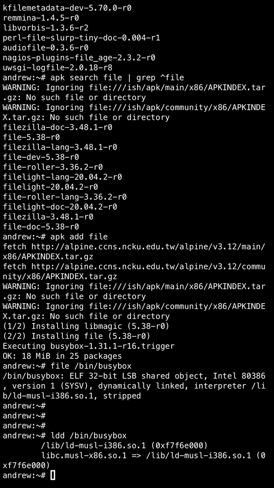

# 移植與跨平台編譯實驗紀錄

---


## 關於移植

首先要知道你目標平台的 arch 資訊。先使用 `apk add file` 安裝 file 指令。然後用 file 查詢任何一個二近位檔，ex: /bin/busybox



file 指令告訴你，透過 iSH 運作的 Alpine Linux 執行在 x86 (Intel 80386) 平台上。而 busybox 使用 dynamically linked 的方式產生執行檔。

```
andrew:~# file /bin/busybox 
/bin/busybox: ELF 32-bit LSB shared object, Intel 80386, version 1 (SYSV), dynamically linked, interpreter /lib/ld-musl-i386.so.1, stripped
```

你還可使用 ldd 查詢 busybox linking 的 shared libs。從這也可以發現，Alpine Linux 使用 [Musl](https://zh.wikipedia.org/wiki/Musl) 當作標準 c-lib。

```
andrew:~# ldd /bin/busybox 
	/lib/ld-musl-i386.so.1 (0xf7f6e000)
	libc.musl-x86.so.1 => /lib/ld-musl-i386.so.1 (0xf7f6e000)
```

uname 的指令可以知道 linux kernel 使用 i686 架構。

```
andrew:/# uname -a
Linux andrew 4.20.69-ish iSH 1.1.1 (91) Dec 21 2020 19:41:45 i686 Linux
```

我們已經得知 Alpine Linux 運作在 32 位元的 i686 平台上，且使用 Musl libc。所以接下來你應該要去 musl 官網取得 toolchain。musl C library 的官網在 [www.musl-libc.org](https://www.musl-libc.org/)。官網有文件告訴你如何編譯原始程式碼並產生 toolchain。

不過有另一個非官方的網站 [musl.cc](https://musl.cc) 已經幫你編好了適合不同平台的 toolchain 了。你可以使用 `curl musl.cc` 來取得所有 toochain 列表:

```
vagrant@ubuntu-xenial:~$ curl -s musl.cc
https://musl.cc/aarch64-linux-musl-cross.tgz
https://musl.cc/aarch64-linux-musl-native.tgz
https://musl.cc/aarch64_be-linux-musl-cross.tgz
https://musl.cc/aarch64_be-linux-musl-native.tgz
https://musl.cc/arm-linux-musleabi-cross.tgz
https://musl.cc/arm-linux-musleabi-native.tgz
https://musl.cc/arm-linux-musleabihf-cross.tgz
https://musl.cc/arm-linux-musleabihf-native.tgz
https://musl.cc/armeb-linux-musleabi-cross.tgz
https://musl.cc/armeb-linux-musleabi-native.tgz
https://musl.cc/armeb-linux-musleabihf-cross.tgz
https://musl.cc/armeb-linux-musleabihf-native.tgz
https://musl.cc/armel-linux-musleabi-cross.tgz
https://musl.cc/armel-linux-musleabi-native.tgz
https://musl.cc/armel-linux-musleabihf-cross.tgz
https://musl.cc/armel-linux-musleabihf-native.tgz
https://musl.cc/armv5l-linux-musleabi-cross.tgz
https://musl.cc/armv5l-linux-musleabi-native.tgz
https://musl.cc/armv5l-linux-musleabihf-cross.tgz
https://musl.cc/armv5l-linux-musleabihf-native.tgz
https://musl.cc/armv6-linux-musleabi-cross.tgz
https://musl.cc/armv6-linux-musleabi-native.tgz
https://musl.cc/armv6-linux-musleabihf-cross.tgz
https://musl.cc/armv6-linux-musleabihf-native.tgz
https://musl.cc/armv7l-linux-musleabihf-cross.tgz
https://musl.cc/armv7l-linux-musleabihf-native.tgz
https://musl.cc/armv7m-linux-musleabi-cross.tgz
https://musl.cc/armv7m-linux-musleabi-native.tgz
https://musl.cc/armv7r-linux-musleabihf-cross.tgz
https://musl.cc/armv7r-linux-musleabihf-native.tgz
https://musl.cc/i486-linux-musl-cross.tgz
https://musl.cc/i486-linux-musl-native.tgz
https://musl.cc/i686-linux-musl-cross.tgz
https://musl.cc/i686-linux-musl-native.tgz
https://musl.cc/i686-w64-mingw32-cross.tgz
https://musl.cc/i686-w64-mingw32-native.zip
https://musl.cc/m68k-linux-musl-cross.tgz
https://musl.cc/m68k-linux-musl-native.tgz
https://musl.cc/microblaze-linux-musl-cross.tgz
https://musl.cc/microblaze-linux-musl-native.tgz
https://musl.cc/microblazeel-linux-musl-cross.tgz
https://musl.cc/microblazeel-linux-musl-native.tgz
https://musl.cc/mips-linux-musl-cross.tgz
https://musl.cc/mips-linux-musl-native.tgz
https://musl.cc/mips-linux-musln32sf-cross.tgz
https://musl.cc/mips-linux-musln32sf-native.tgz
https://musl.cc/mips-linux-muslsf-cross.tgz
https://musl.cc/mips-linux-muslsf-native.tgz
https://musl.cc/mips64-linux-musl-cross.tgz
https://musl.cc/mips64-linux-musl-native.tgz
https://musl.cc/mips64-linux-musln32-cross.tgz
https://musl.cc/mips64-linux-musln32-native.tgz
https://musl.cc/mips64-linux-musln32sf-cross.tgz
https://musl.cc/mips64-linux-musln32sf-native.tgz
https://musl.cc/mips64el-linux-musl-cross.tgz
https://musl.cc/mips64el-linux-musl-native.tgz
https://musl.cc/mips64el-linux-musln32-cross.tgz
https://musl.cc/mips64el-linux-musln32-native.tgz
https://musl.cc/mips64el-linux-musln32sf-cross.tgz
https://musl.cc/mips64el-linux-musln32sf-native.tgz
https://musl.cc/mipsel-linux-musl-cross.tgz
https://musl.cc/mipsel-linux-musl-native.tgz
https://musl.cc/mipsel-linux-musln32-cross.tgz
https://musl.cc/mipsel-linux-musln32-native.tgz
https://musl.cc/mipsel-linux-musln32sf-cross.tgz
https://musl.cc/mipsel-linux-musln32sf-native.tgz
https://musl.cc/mipsel-linux-muslsf-cross.tgz
https://musl.cc/mipsel-linux-muslsf-native.tgz
https://musl.cc/or1k-linux-musl-cross.tgz
https://musl.cc/or1k-linux-musl-native.tgz
https://musl.cc/powerpc-linux-musl-cross.tgz
https://musl.cc/powerpc-linux-musl-native.tgz
https://musl.cc/powerpc-linux-muslsf-cross.tgz
https://musl.cc/powerpc-linux-muslsf-native.tgz
https://musl.cc/powerpc64-linux-musl-cross.tgz
https://musl.cc/powerpc64-linux-musl-native.tgz
https://musl.cc/powerpc64le-linux-musl-cross.tgz
https://musl.cc/powerpc64le-linux-musl-native.tgz
https://musl.cc/powerpcle-linux-musl-cross.tgz
https://musl.cc/powerpcle-linux-musl-native.tgz
https://musl.cc/powerpcle-linux-muslsf-cross.tgz
https://musl.cc/powerpcle-linux-muslsf-native.tgz
https://musl.cc/riscv32-linux-musl-cross.tgz
https://musl.cc/riscv32-linux-musl-native.tgz
https://musl.cc/riscv64-linux-musl-cross.tgz
https://musl.cc/riscv64-linux-musl-native.tgz
https://musl.cc/s390x-linux-musl-cross.tgz
https://musl.cc/s390x-linux-musl-native.tgz
https://musl.cc/sh2-linux-musl-cross.tgz
https://musl.cc/sh2-linux-musl-native.tgz
https://musl.cc/sh2-linux-muslfdpic-cross.tgz
https://musl.cc/sh2-linux-muslfdpic-native.tgz
https://musl.cc/sh2eb-linux-musl-cross.tgz
https://musl.cc/sh2eb-linux-musl-native.tgz
https://musl.cc/sh2eb-linux-muslfdpic-cross.tgz
https://musl.cc/sh2eb-linux-muslfdpic-native.tgz
https://musl.cc/sh4-linux-musl-cross.tgz
https://musl.cc/sh4-linux-musl-native.tgz
https://musl.cc/sh4eb-linux-musl-cross.tgz
https://musl.cc/sh4eb-linux-musl-native.tgz
https://musl.cc/x86_64-linux-musl-cross.tgz
https://musl.cc/x86_64-linux-musl-native.tgz
https://musl.cc/x86_64-linux-muslx32-cross.tgz
https://musl.cc/x86_64-linux-muslx32-native.tgz
https://musl.cc/x86_64-w64-mingw32-cross.tgz
https://musl.cc/x86_64-w64-mingw32-native.zip
``` 

musl.cc 上的 toolchain tarball，後綴名稱有 `-native` 表示適合在 target 端使用，也就是使用 native compiling。`-cross` 則是 cross compiler，適合運作在 host 端。

前綴名稱則是 target 端運作的平台名稱。例如在 Raspberry Pi4 上可以查到 Pi4 的 linux kernel 運作於 armv7l 平台上：

```
pi@raspberrypi:~ $ uname -a
Linux raspberrypi 5.4.83-v7l+ #1379 SMP Mon Dec 14 13:11:54 GMT 2020 armv7l GNU/Linux

pi@raspberrypi:~ $ file /bin/ls
/bin/ls: ELF 32-bit LSB executable, ARM, EABI5 version 1 (SYSV), dynamically linked, interpreter /lib/ld-linux-armhf.so.3, for GNU/Linux 3.2.0, BuildID[sha1]=67a394390830ea3ab4e83b5811c66fea9784ee69, stripped
```

因此，下面這兩個 toolchain，一個就是給 target 端 (-native) 用的，另一個則是 host (-cross) 端。

```
pi@raspberrypi:~ $ curl -s musl.cc | grep armv7l
https://musl.cc/armv7l-linux-musleabihf-cross.tgz
https://musl.cc/armv7l-linux-musleabihf-native.tgz
```


## 使用原生編譯 (native compiling)

原生的意思是指直接在最終平台上 (target platform) 編譯程式碼，這裡所指的最終平台當然就是 iphone 上由 iSH 所建構的 Alpine Linux 啦!

當然你也可以使用 apk 安裝 toolchain 即可，這邊只是示範手動的方式。

你需要直接將 musl.cc 提供的 toolchain 下載到 Alpine Linux 中。


```
andrew:/# apk add curl
fetch http://alpine.ccns.ncku.edu.tw/alpine/v3.12/main/x86/APKINDEX.tar.gz
fetch http://alpine.ccns.ncku.edu.tw/alpine/v3.12/community/x86/APKINDEX.tar.gz
(1/1) Installing curl (7.69.1-r3)
Executing busybox-1.31.1-r16.trigger
OK: 69 MiB in 42 packages

andrew:/# 
andrew:/# curl -s musl.cc | grep i686 | grep linux
https://musl.cc/i686-linux-musl-cross.tgz
https://musl.cc/i686-linux-musl-native.tgz
andrew:/#
```

因為直接在 target 端 (iphone 上) 編譯，所以下載 `i686-linux-musl-native.tgz`

```
andrew:~/ws# wget https://musl.cc/i686-linux-musl-native.tgz
Connecting to musl.cc (104.232.42.245:443)
saving to 'i686-linux-musl-native.tgz'
i686-linux-musl-nati 100% |************************| 84.0M  0:00:00 ETA
'i686-linux-musl-native.tgz' saved
andrew:~/ws# 
andrew:~/ws# ls -l
total 86036
-rw-r--r--    1 root     root            78 Mar 21 11:28 hello.c
-rw-r--r--    1 root     root      88091366 Mar 24 13:07 i686-linux-musl-native.tgz
andrew:~/ws# 
```

解壓縮...真的蠻久的 @@

```
andrew:~/ws# tar -zxvf i686-linux-musl-native.tgz 
i686-linux-musl-native/
i686-linux-musl-native/usr
i686-linux-musl-native/libexec/
i686-linux-musl-native/libexec/gcc/
i686-linux-musl-native/libexec/gcc/i686-linux-musl/
i686-linux-musl-native/libexec/gcc/i686-linux-musl/10.2.1/
i686-linux-musl-native/libexec/gcc/i686-linux-musl/10.2.1/collect2
i686-linux-musl-native/libexec/gcc/i686-linux-musl/10.2.1/lto1
...
..
.
i686-linux-musl-native/lib/libcrypt.a
i686-linux-musl-native/lib/libc.a
i686-linux-musl-native/lib/libc.so
i686-linux-musl-native/lib/rcrt1.o
i686-linux-musl-native/lib/crtn.o
i686-linux-musl-native/lib/Scrt1.o
i686-linux-musl-native/lib/crti.o
i686-linux-musl-native/lib/crt1.o

```

完成，來看看有什麼吧。

```
andrew:~/ws# ls
hello.c                     i686-linux-musl-native      i686-linux-musl-native.tgz
andrew:~/ws# ls -l
total 86036
-rw-r--r--    1 root     root            78 Mar 21 11:28 hello.c
drwxr-xr-x    9 1000     1000           288 Mar 24 13:15 i686-linux-musl-native
-rw-r--r--    1 root     root      88091366 Mar 24 13:07 i686-linux-musl-native.tgz
andrew:~/ws# ls -l i686-linux-musl-native
total 4
drwxrwxr-x   41 1000     1000          1312 Mar 24 13:15 bin
drwxrwxr-x    4 1000     1000           128 Mar 24 13:12 i686-linux-musl
drwxr-xr-x  119 1000     1000          3808 Mar 24 13:14 include
drwxr-xr-x   71 1000     1000          2272 Mar 24 13:15 lib
drwxrwxr-x    3 1000     1000            96 Mar 24 13:11 libexec
drwxrwxr-x    5 1000     1000           160 Mar 24 13:14 share
lrwxrwxrwx    1 root     root             1 Mar 24 13:11 usr -> .
andrew:~/ws# ls i686-linux-musl-native/bin/
addr2line                   dwp                         gcc-ranlib                  i686-linux-musl-c++         i686-linux-musl-gcc-nm      lto-dump                    size
ar                          elfedit                     gcov                        i686-linux-musl-cc          i686-linux-musl-gcc-ranlib  nm                          strings
as                          g++                         gcov-dump                   i686-linux-musl-g++         i686-linux-musl-gfortran    objcopy                     strip
c++                         gcc                         gcov-tool                   i686-linux-musl-gcc         ld                          objdump
c++filt                     gcc-ar                      gfortran                    i686-linux-musl-gcc-10.2.1  ld.bfd                      ranlib
cpp                         gcc-nm                      gprof                       i686-linux-musl-gcc-ar      ld.gold                     readelf
```

隨便寫個 hello.c 來試試看

```
andrew:~/ws# cat hello.c 
#include <stdio.h>

int main(void) {
	printf("Hello! World!\n");
	return 0;
}
```

以 i686-linux-musl-gcc 編譯 hello.c

```
andrew:~/ws# ls
hello.c                     i686-linux-musl-native      i686-linux-musl-native.tgz
andrew:~/ws# ./i686-linux-musl-native/bin/i686-linux-musl-gcc -o hello_native hello.c 
cc1: internal compiler error: Illegal instruction
Please submit a full bug report,
with preprocessed source if appropriate.
See <https://gcc.gnu.org/bugs/> for instructions.
andrew:~/ws# 
```

竟然編譯失敗！@@ 不知道甚麼問題...

降版 i486-linux-musl-native.tgz 試試看...

```
andrew:~/ws# curl -s musl.cc | grep linux | grep i486 | grep native
https://musl.cc/i486-linux-musl-native.tgz
andrew:~/ws# 
andrew:~/ws# wget https://musl.cc/i486-linux-musl-native.tgz
andrew:~/ws# tar -zxf i486-linux-musl-native.tgz
```

竟然要 i486 的 toolchain 才行！

```
andrew:~/ws# ./i486-linux-musl-native/bin/i486-linux-musl-gcc -o hello_native hello.c 
andrew:~/ws# ls -l
total 172232
-rw-r--r--    1 root     root            78 Mar 21 11:28 hello.c
-rwxr-xr-x    1 root     root          6784 Mar 24 13:31 hello_native
drwxrwxr-x    9 1000     1000           288 Mar 24 13:28 i486-linux-musl-native
-rw-r--r--    1 root     root      88256528 Mar 24 13:25 i486-linux-musl-native.tgz
drwxr-xr-x    9 1000     1000           288 Mar 24 13:15 i686-linux-musl-native
-rw-r--r--    1 root     root      88091366 Mar 24 13:07 i686-linux-musl-native.tgz
andrew:~/ws# file hello_native 
hello_native: ELF 32-bit LSB shared object, Intel 80386, version 1 (SYSV), dynamically linked, interpreter /lib/ld-musl-i386.so.1, not stripped
andrew:~/ws# ./hello_native 
Hello! World!
andrew:~/ws# 
```


### 使用跨平台編譯 (cross compiling)

通常嵌入式系統的開發方式很少會用 native compiling，因為 target 端的運算能力通常遠不如 host 端，通訊介面也較少。開發上比較傾向`在 host 端編譯 for target 端的程式`，這個動作就稱為跨平台編譯 (cross compiling)。

與 native compiling 不同的是，編譯的行為不在 target 端 (ex: 手機) 而是 host 端 (ex: Linux 主機)，所以 toolchain 必須要能在 host 端上運作，你需要下載的是 armv7l-linux-musleabihf-cross.tgz。


```
vagrant@ubuntu-xenial:~/ws$ curl -s musl.cc | grep i686 | grep linux
https://musl.cc/i686-linux-musl-cross.tgz
https://musl.cc/i686-linux-musl-native.tgz
vagrant@ubuntu-xenial:~/ws$ wget https://musl.cc/i686-linux-musl-cross.tgz
--2021-03-24 13:14:51--  https://musl.cc/i686-linux-musl-cross.tgz
Resolving musl.cc (musl.cc)... 104.232.42.245
Connecting to musl.cc (musl.cc)|104.232.42.245|:443... connected.
HTTP request sent, awaiting response... 200 OK
Length: 109438806 (104M) [application/octet-stream]
Saving to: ‘i686-linux-musl-cross.tgz’

i686-linux-musl-cross.tgz       100%[===================>] 104.37M  1.23MB/s    in 85s     

2021-03-24 13:16:18 (1.22 MB/s) - ‘i686-linux-musl-cross.tgz’ saved [109438806/109438806]

vagrant@ubuntu-xenial:~/ws$ 
vagrant@ubuntu-xenial:~/ws$ ls
hello.c  i686-linux-musl-cross.tgz
vagrant@ubuntu-xenial:~/ws$ tar -zxf i686-linux-musl-cross.tgz 
vagrant@ubuntu-xenial:~/ws$ ls -l
total 106884
-rw-rw-r-- 1 vagrant vagrant        94 Mar 24 11:30 hello.c
drwxrwxr-x 8 vagrant vagrant      4096 Mar  2 16:14 i686-linux-musl-cross
-rw-rw-r-- 1 vagrant vagrant 109438806 Mar  4 00:38 i686-linux-musl-cross.tgz
vagrant@ubuntu-xenial:~/ws$ ./i686-linux-musl-cross/bin/i686-linux-musl-gcc -o hello_cross_shared hello.c 
vagrant@ubuntu-xenial:~/ws$ ls -l
total 106892
-rw-rw-r-- 1 vagrant vagrant        94 Mar 24 11:30 hello.c
-rwxrwxr-x 1 vagrant vagrant      6764 Mar 24 13:22 hello_cross_shared
drwxrwxr-x 8 vagrant vagrant      4096 Mar  2 16:14 i686-linux-musl-cross
-rw-rw-r-- 1 vagrant vagrant 109438806 Mar  4 00:38 i686-linux-musl-cross.tgz
vagrant@ubuntu-xenial:~/ws$ file hello_cross_shared 
hello_cross_shared: ELF 32-bit LSB shared object, Intel 80386, version 1 (SYSV), dynamically linked, interpreter /lib/ld-musl-i386.so.1, not stripped
vagrant@ubuntu-xenial:~/ws$ ./hello_cross_shared 
-bash: ./hello_cross_shared: No such file or directory
vagrant@ubuntu-xenial:~/ws$ 
```

```
vagrant@ubuntu-xenial:~/ws$ ./i686-linux-musl-cross/bin/i686-linux-musl-gcc -o hello_cross_static hello.c --static
vagrant@ubuntu-xenial:~/ws$ ls -l
total 106908
-rw-rw-r-- 1 vagrant vagrant        94 Mar 24 11:30 hello.c
-rwxrwxr-x 1 vagrant vagrant      6764 Mar 24 13:22 hello_cross_shared
-rwxrwxr-x 1 vagrant vagrant     13160 Mar 24 13:23 hello_cross_static
drwxrwxr-x 8 vagrant vagrant      4096 Mar  2 16:14 i686-linux-musl-cross
-rw-rw-r-- 1 vagrant vagrant 109438806 Mar  4 00:38 i686-linux-musl-cross.tgz
vagrant@ubuntu-xenial:~/ws$ file hello_*
hello_cross_shared: ELF 32-bit LSB shared object, Intel 80386, version 1 (SYSV), dynamically linked, interpreter /lib/ld-musl-i386.so.1, not stripped
hello_cross_static: ELF 32-bit LSB executable, Intel 80386, version 1 (SYSV), statically linked, not stripped
vagrant@ubuntu-xenial:~/ws$ 
```

```
vagrant@ubuntu-xenial:~/ws$ ./hello_cross_static 
Hello World!
vagrant@ubuntu-xenial:~/ws$ ./hello_cross_shared 
-bash: ./hello_cross_shared: No such file or directory
```

```
vagrant@ubuntu-xenial:~/ws$ ./i686-linux-musl-cross/bin/i686-linux-musl-objdump -x hello_cross_shared | grep NEEDED
  NEEDED               libc.so
vagrant@ubuntu-xenial:~/ws$ find i686-linux-musl-cross/ -name ld-musl-i386.so.1
i686-linux-musl-cross/i686-linux-musl/lib/ld-musl-i386.so.1
vagrant@ubuntu-xenial:~/ws$ ls -l i686-linux-musl-cross/i686-linux-musl/lib/ld-musl-i386.so.1
lrwxrwxrwx 1 vagrant vagrant 12 Mar  2 16:13 i686-linux-musl-cross/i686-linux-musl/lib/ld-musl-i386.so.1 -> /lib/libc.so
vagrant@ubuntu-xenial:~/ws$ 
```

```
vagrant@ubuntu-xenial:~/ws$ scp hello_cross_* root@172.16.99.153:/root/ws/
root@172.16.99.153's password: 
hello_cross_shared                         100% 6764     6.6KB/s   00:00    
hello_cross_static                         100%   13KB  12.9KB/s   00:00    
vagrant@ubuntu-xenial:~/ws$ 
```

```
andrew:~/ws# ls -l
total 86228
-rw-r--r--    1 root     root            78 Mar 21 11:28 hello.c
-rwxr-xr-x    1 root     root          6764 Mar 24 13:38 hello_cross_shared
-rwxr-xr-x    1 root     root         13160 Mar 24 13:38 hello_cross_static
-rwxr-xr-x    1 root     root          6784 Mar 24 13:31 hello_native
drwxrwxr-x    9 1000     1000           288 Mar 24 13:28 i486-linux-musl-native
-rw-r--r--    1 root     root      88256528 Mar 24 13:25 i486-linux-musl-native.tgz
andrew:~/ws# file hello_*
hello_cross_shared: ELF 32-bit LSB shared object, Intel 80386, version 1 (SYSV), dynamically linked, interpreter /lib/ld-musl-i386.so.1, not stripped
hello_cross_static: ELF 32-bit LSB executable, Intel 80386, version 1 (SYSV), statically linked, not stripped
hello_native:       ELF 32-bit LSB shared object, Intel 80386, version 1 (SYSV), dynamically linked, interpreter /lib/ld-musl-i386.so.1, not stripped
andrew:~/ws# 
```

```
andrew:~/ws# ./hello_cross_static 
Hello World!
andrew:~/ws# ./hello_cross_shared 
Hello World!
andrew:~/ws# ldd ./hello_cross_shared 
	/lib/ld-musl-i386.so.1 (0xf7f6e000)
	libc.so => /lib/ld-musl-i386.so.1 (0xf7f6e000)
andrew:~/ws# 
```


### 參考資源

* [How to Use musl](https://www.musl-libc.org/how.html)
* [Cross-compiling with musl Toolchains](https://ariya.io/2020/06/cross-compiling-with-musl-toolchains)
* [git.musl-libc.org](https://git.musl-libc.org/cgit/musl)
* [Your source for static cross- and native- musl-based toolchains.](https://musl.cc/)