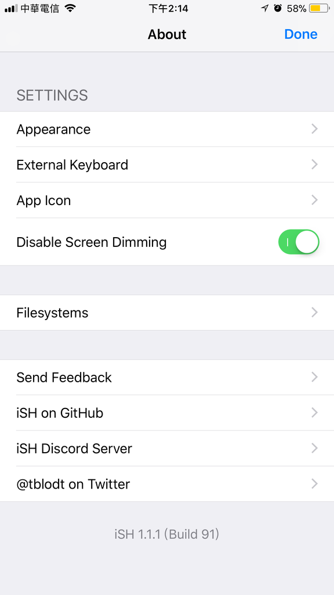
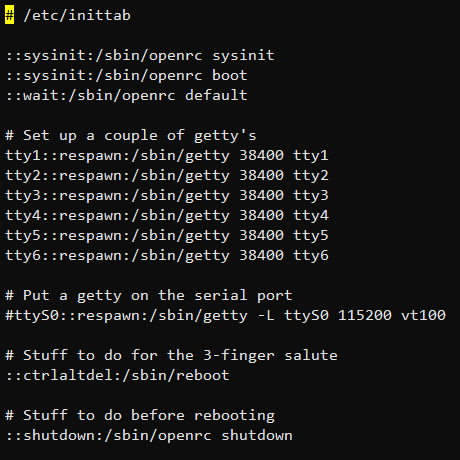
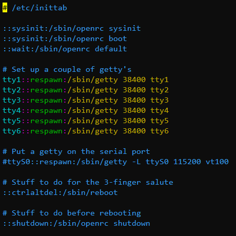
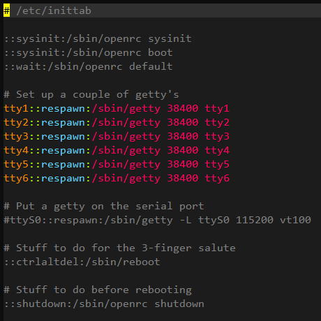
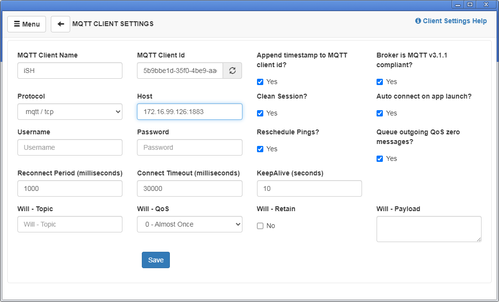
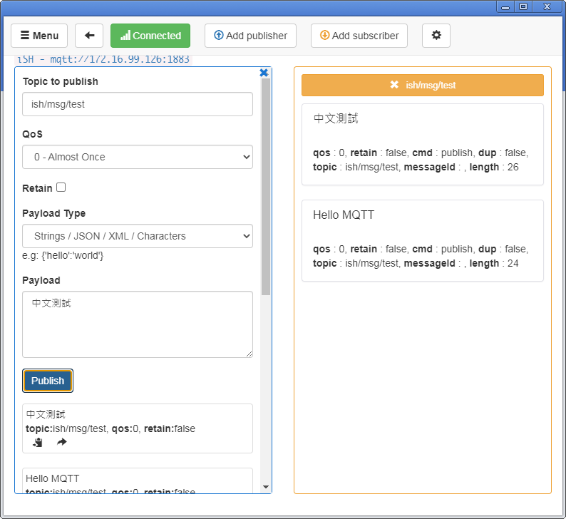
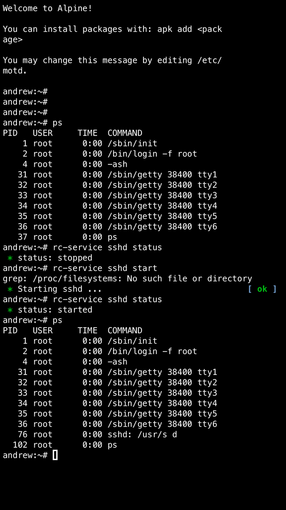
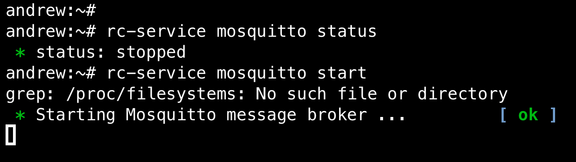
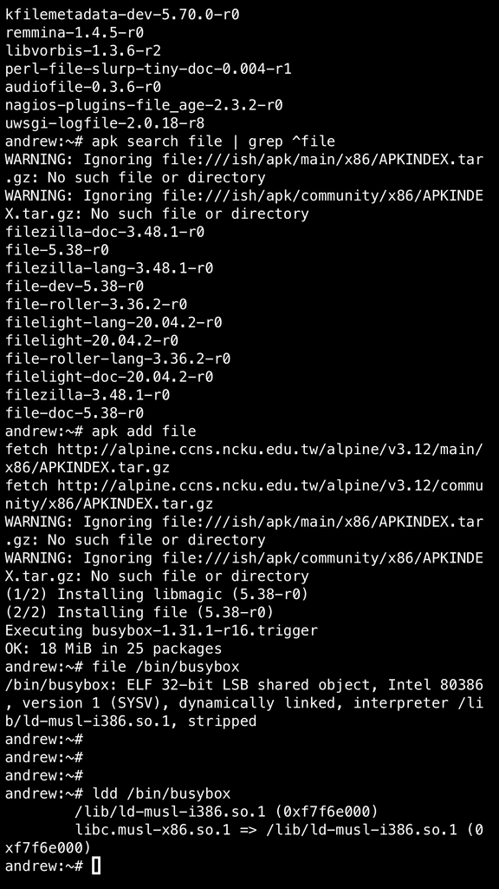

# iSH Alpine Linux 實驗

---

## 關於這篇文章

這篇文章記錄一些我安裝玩 Alpine Linux on iSH 後的一些實驗和測試。

如果你還沒用過 iSH，請參考我寫的 [iSH Quickstart Guide](README.md)。

我所使用的手機是 iPhone 6s Plus 128GB, iOS 11.0.2。透過連線 WiFi 路由器出 internet。

ps: 在這篇文章中，如果我提到 "Alpine Linux" 或是簡稱 "Alpine"，所指稱的是透過 iphone 上的 iSH APP 所啟動的 Alpine Linux 作業系統。


## iPhone 熱點

1. 開啟 iphone 熱點
2. 開啟 iSH
3. 在 Alpine Linux 中啟用 sshd
4. 筆電連線 iphone 熱點
5. 筆電端以 ssh 連線 iphone IP
6. 結果: 可以成功連進 iSH 內的 Alpine Linux

與 Android 不同的是，iphone 熱點開啟的時候，DHCP 配發的 ip range 會落在一個網段區間內 172.20.10.x。iphone 本身的 gateway ip 通常是 172.20.10.1。所以當你的筆電接入了 iphone 的熱點，應該會拿到 172.20.10.x 的 ip。這時候只需要 ssh 連線 172.20.10.1 就可以進入 Alpine Linux 了。

這個特性的應用就非常有趣了，我可以在 iSH 的 Linux 環境中架設伺服器。然後我就有一台移動式的伺服器可隨時測試使用了，你可能不會隨時帶著一台 pi zero，但是你通常會隨身帶著手機。透過熱點分享後，手機拿到哪都可以快速建構一個區網測試環境。


## iSH 背景執行

根據測試結果，當 iSH App 在背景執行的時候 (例如按了手機 HOME 鍵)，ssh 會無法連線。似乎 iSH 必須在前景運作時，ssh 連線的行為才能正常使用。

同理當手機進入休眠的時候，Alpine Linux 也會停止運作。你可以設定讓手機不進入休眠，或是進入 iSH 的設定頁面中開啟 `Disable Screen Dimming` (他的意思其實是 "Keep screen turned on")




## iPhone 換 ip

測試時我先讓 iphone 熱點開啟，確定筆電連上熱點後，ssh 可以登入 Alpine Linux。接著我立刻將熱點停用，改讓 iphone 和筆電連線同一台 wifi router。

結果是 ssh 連線會斷，似乎無法立刻切換網路。你需要在 Alpine 上依照下面的指令重新啟動 sshd。ssh 再重新連線即可。


```
andrew:~# ps # 查詢 sshd 的 PID
andrew:~# kill <PID>
andrew:~# /usr/sbin/sshd
andrew:~# ps
PID   USER     TIME  COMMAND
    1 root      0:00 /sbin/init
    2 root      0:00 /bin/login -f root
    4 root      0:00 -ash
    7 root      0:00 /sbin/getty 38400 tty1
    8 root      0:00 /sbin/getty 38400 tty2
    9 root      0:00 /sbin/getty 38400 tty3
   10 root      0:00 /sbin/getty 38400 tty4
   11 root      0:00 /sbin/getty 38400 tty5
   12 root      0:00 /sbin/getty 38400 tty6
   16 root      0:00 sshd: /usr/s d			# <== 有啟動
   18 root      0:00 sshd: root@pts/ R
   20 root      0:00 -ash
   21 root      0:00 ps
andrew:~# 
```

## 安裝 vim

iSH 安裝的 Alpine 預設的 vi 指令其實是 busybox 提供的

```
andrew:~# ls -l `which vi`
lrwxrwxrwx    1 root     root            12 Mar 18 11:48 /usr/bin/vi -> /bin/busybox
```

所以打開設定檔或是程式碼的時候，都不會有 syntax highlighting 的功能。如下圖...很乏味 XD



只好手動自己裝 vim

```
andrew:~# apk add vim
(1/3) Installing xxd (8.2.0735-r0)
(2/3) Installing lua5.3-libs (5.3.5-r6)
(3/3) Installing vim (8.2.0735-r0)
 36% ###################################
Executing busybox-1.31.1-r16.trigger
OK: 48 MiB in 32 packages

andrew:~# ls -l `which vim`
-rwxr-xr-x    1 root     root       2739884 May 15  2020 /usr/bin/vim
```

裝完 vim 後預設的 syntax highlight color scheme 我不喜歡，而且預設的 tab 是 8 個空白，所以我會再做些額外的設定。




### 設定 vim 環境

安裝 git

```
andrew:~# apk add git
fetch http://alpine.ccns.ncku.edu.tw/alpine/v3.12/main/x86/APKINDEX.tar.gz
fetch http://alpine.ccns.ncku.edu.tw/alpine/v3.12/community/x86/APKINDEX.tar.gz
(1/6) Installing ca-certificates (20191127-r4)
(2/6) Installing nghttp2-libs (1.41.0-r0)
(3/6) Installing libcurl (7.69.1-r3)
(4/6) Installing expat (2.2.9-r1)
(5/6) Installing pcre2 (10.35-r0)
(6/6) Installing git (2.26.3-r0)
Executing busybox-1.31.1-r16.trigger
Executing ca-certificates-20191127-r4.trigger
OK: 67 MiB in 38 packages
```

安裝 vim plugins

```
andrew:~# mkdir -p ~/.vim/bundle ~/.vim/autoload
andrew:~# cd ~/.vim/autoload/
andrew:~/.vim/autoload# wget https://tpo.pe/pathogen.vim
Connecting to tpo.pe (45.56.74.76:443)
Connecting to raw.githubusercontent.com (185.199.111.133:443)
saving to 'pathogen.vim'
pathogen.vim         100% |****************|  8854  0:00:00 ETA
'pathogen.vim' saved
andrew:~/.vim/autoload# ls
pathogen.vim
andrew:~/.vim/autoload# cd ~
andrew:~# 
```

我喜歡 molokai 這個 molokai color scheme

```
andrew:~# cd ~/.vim/bundle
andrew:~/.vim/bundle# git clone https://github.com/tomasr/molokai.git  
Cloning into 'molokai'...
remote: Enumerating objects: 148, done.
remote: Total 148 (delta 0), reused 0 (delta 0), pack-reused 148
Receiving objects: 100% (148/148), 27.68 KiB | 54.00 KiB/s, done.
Resolving deltas: 100% (35/35), done.
andrew:~/.vim/bundle# ls -l
total 0
drwxr-xr-x    6 root     root           192 Mar 19 11:43 molokai
```

molokai 的色彩配置




下載我自己習慣的設定檔 (~/.vimrc)

```
andrew:~# wget https://raw.githubusercontent.com/andrewintw/skel-home/master/config/vimrc
Connecting to raw.githubusercontent.com (185.199.110.133:443)
saving to 'vimrc'
vimrc                100% |******************|  2381  0:00:00 ETA
'vimrc' saved
andrew:~# mv vimrc .vimrc
```

將 vi link 到 vim。通常會透過 alias 來做，但這算是嵌入式系統，就自己硬來改 symbolic link 吧!

```
andrew:~# ls -l `which vi`
lrwxrwxrwx    1 root     root            12 Mar 18 11:48 /usr/bin/vi -> /bin/busybox
andrew:~# which vim
/usr/bin/vim
andrew:~# cd /usr/bin/
andrew:/usr/bin# rm -f vi
andrew:/usr/bin# ln -s vi
view      vim       vimtutor
andrew:/usr/bin# ln -s vim vi
andrew:/usr/bin# ls -l vi
lrwxrwxrwx    1 root     root             3 Mar 19 11:54 vi -> vim
andrew:/usr/bin#
``` 


## 架設 MQTT server

剛剛提到手機因為有熱點這個優勢，所以可以透過熱點隨時讓手機配合 iSH 變身為一個行動測試伺服器，那就來測試看看吧。

這邊我想測試的是 MQTT Broker!! 因為之前在 Apple App Store 上查詢 MQTT，其實找到的 Apps 都是 MQTT client 的 Apps。似乎沒有 MQTT Broker 的 App。既然我現在能在 iOS 上啟用一個 Linux 環境，Linux 對外的網路也是通的，應該可以試著弄個 MQTT Broker 吧!

搜尋使否有 mosquitto 可以使用 --- 有!

```
andrew:~# apk update
fetch http://alpine.ccns.ncku.edu.tw/alpine/v3.12/main/x86/APKINDEX.tar.gz
fetch http://alpine.ccns.ncku.edu.tw/alpine/v3.12/community/x86/APKINDEX.tar.gz
v3.12.4-15-g2a00f4f299 [http://alpine.ccns.ncku.edu.tw/alpine/v3.12/main]
v3.12.4-16-gd3ffa75891 [http://alpine.ccns.ncku.edu.tw/alpine/v3.12/community]
OK: 12544 distinct packages available
andrew:~# 

andrew:~# apk search mosquitto
mosquitto-dev-1.6.9-r0
mosquitto-1.6.9-r0
lua5.3-mosquitto-0.3-r1
lua5.1-mosquitto-0.3-r1
lua5.2-mosquitto-0.3-r1
mosquitto-libs-1.6.9-r0
mosquitto-libs++-1.6.9-r0
mosquitto-clients-1.6.9-r0
mosquitto-doc-1.6.9-r0
mosquitto-dbg-1.6.9-r0
mosquitto-openrc-1.6.9-r0
lua-mosquitto-0.3-r1
andrew:~# 
``` 

那就不客氣了，安裝!

```
andrew:~# apk add mosquitto
fetch http://alpine.ccns.ncku.edu.tw/alpine/v3.12/main/x86/APKINDEX.tar.gz
fetch http://alpine.ccns.ncku.edu.tw/alpine/v3.12/community/x86/APKINDEX.tar.gz
(1/4) Installing c-ares (1.16.1-r0)
(2/4) Installing mosquitto-libs (1.6.9-r0)
(3/4) Installing libwebsockets (3.2.2-r0)
(4/4) Installing mosquitto (1.6.9-r0)
Executing mosquitto-1.6.9-r0.pre-install
Executing busybox-1.31.1-r16.trigger
OK: 19 MiB in 29 packages
andrew:~# 
```

因為我只是要把 iphone 當作 MQTT broker，所以 mosquitto-clients 我就不安裝了。

確認是否有安裝，順便玩一下 apk 指令:

```
andrew:~# apk info 
musl
busybox
alpine-baselayout
alpine-keys
libcrypto1.1
libssl1.1
ca-certificates-bundle
libtls-standalone
ssl_client
zlib
apk-tools
scanelf
musl-utils
libc-utils
openssh-keygen
ncurses-terminfo-base
ncurses-libs
libedit
openssh-client
openssh-sftp-server
openssh-server-common
openssh-server
openssh
libmagic
file
c-ares
mosquitto-libs
libwebsockets
mosquitto		# <== 這裡
```

查查 mosquitto 裝了什麼東西:

```
andrew:~# apk info -L mosquitto
mosquitto-1.6.9-r0 contains:
etc/mosquitto/aclfile.example
etc/mosquitto/mosquitto.conf
etc/mosquitto/pskfile.example
etc/mosquitto/pwfile.example
usr/bin/mosquitto_passwd
usr/bin/mosquitto_rr
usr/sbin/mosquitto

andrew:~# 
```

### mosquitto 啟用 & 測試

```
andrew:~# ps
PID   USER     TIME  COMMAND
    1 root      0:00 /sbin/init
    2 root      0:00 /bin/login -f root
    5 root      0:00 -ash
    7 root      0:00 /sbin/getty 38400 tty1
    8 root      0:00 /sbin/getty 38400 tty2
    9 root      0:00 /sbin/getty 38400 tty3
   10 root      0:00 /sbin/getty 38400 tty4
   11 root      0:00 /sbin/getty 38400 tty5
   12 root      0:00 /sbin/getty 38400 tty6
   15 root      0:00 sshd: /usr/s d
   16 root      0:00 sshd: root@pts/ R
   18 root      0:00 -ash
   81 root      0:00 ps

andrew:~# mosquitto --help
mosquitto version 1.6.9

mosquitto is an MQTT v3.1.1 broker.

Usage: mosquitto [-c config_file] [-d] [-h] [-p port]

 -c : specify the broker config file.
 -d : put the broker into the background after starting.
 -h : display this help.
 -p : start the broker listening on the specified port.
      Not recommended in conjunction with the -c option.
 -v : verbose mode - enable all logging types. This overrides
      any logging options given in the config file.

See http://mosquitto.org/ for more information.

andrew:~# mosquitto -d
 
andrew:~# ps
PID   USER     TIME  COMMAND
    1 root      0:00 /sbin/init
    2 root      0:00 /bin/login -f root
    5 root      0:00 -ash
    7 root      0:00 /sbin/getty 38400 tty1
    8 root      0:00 /sbin/getty 38400 tty2
    9 root      0:00 /sbin/getty 38400 tty3
   10 root      0:00 /sbin/getty 38400 tty4
   11 root      0:00 /sbin/getty 38400 tty5
   12 root      0:00 /sbin/getty 38400 tty6
   15 root      0:00 sshd: /usr/s d
   16 root      0:00 sshd: root@pts/ R
   18 root      0:00 -ash
   83 root      0:00 mosquitto -d	# <== 這裡
   84 root      0:00 ps
```

啟動後我在筆電上使用 MQTTBox 做 MQTT subscribe & publish 的測試，正常執行!





現在你可以隨身帶著一台 MQTT Broker (aka 你的 iphone) 出門了。


## 啟動流程 --- OpenRC

### 為什麼要研究這件事情?

你可以發現每次我們要啟用 sshd 或是 mosquitto 時，我都需要自己手動打指令，而不是由系統自動將服務帶起的。

在一般 Linux 系統中，這些服務的啟用都是由一個稱為 Init System 所處理的。Linux 發展至今已經有幾個 Init System 了。目前主流的 Linux distro 幾乎都使用 systemd。而 Alpine 所使用的 Init System 則是一個適用於嵌入式系統的 OpenRC。


### iSH 上啟用 OpenRC

參考 iSH 官方 WiKi 的這份文件:

* **(Tutorials) [How To Enable OpenRC & Start Services When iSH App Starts](https://github.com/ish-app/ish/wiki/How-To-Enable-OpenRC-&-Start-Services-When-iSH-App-Starts)**

裡面提到 "iSH 1.0.1 (Build 77)" 以後，OpenRC 就無法正常運作了。實際上文件的意思應該是 -- 不是每個 service 都可以透過 OpenRC 啟用。

我目前所使用的 iSH 版本為 1.1.1 (Build 91)，沒關係就來試試看吧!


修改 `/etc/inittab`。目前的樣子如下。

```
andrew:~# cat /etc/inittab 
# /etc/inittab

::sysinit:/sbin/openrc sysinit
::sysinit:/sbin/openrc boot
::wait:/sbin/openrc default

# Set up a couple of getty's
tty1::respawn:/sbin/getty 38400 tty1
tty2::respawn:/sbin/getty 38400 tty2
tty3::respawn:/sbin/getty 38400 tty3
tty4::respawn:/sbin/getty 38400 tty4
tty5::respawn:/sbin/getty 38400 tty5
tty6::respawn:/sbin/getty 38400 tty6

# Put a getty on the serial port
#ttyS0::respawn:/sbin/getty -L ttyS0 115200 vt100

# Stuff to do for the 3-finger salute
::ctrlaltdel:/sbin/reboot

# Stuff to do before rebooting
::shutdown:/sbin/openrc shutdown
andrew:~# vi /etc/inittab
...
```

要改 `::sysinit:/sbin/openrc sysinit` 這一行，將 "sysinit" 拿掉。修改後的樣子

```
andrew:~# head  /etc/inittab 
# /etc/inittab

#::sysinit:/sbin/openrc sysinit		# <== 原本樣子
::sysinit:/sbin/openrc				# <== 修改後
::sysinit:/sbin/openrc boot
::wait:/sbin/openrc default

# Set up a couple of getty's
tty1::respawn:/sbin/getty 38400 tty1
tty2::respawn:/sbin/getty 38400 tty2
```

修改完當下，目前沒有文件上所說的 rc-status 這個指令，重啟 iSH App

```
andrew:~# rc-status --help
-ash: rc-status: not found
andrew:~# 
andrew:~# poweroff 
andrew:~# 
```

重啟 iSH App 後，還是沒有 rc-status 這個指令，看來要自己安裝

```
andrew:~# apk search rc-status
openrc-0.42.1-r11
andrew:~# apk info | grep openrc
andrew:~# 
andrew:~# 
andrew:~# apk add openrc
(1/2) Installing openrc (0.42.1-r11)
Executing openrc-0.42.1-r11.post-install
(2/2) Installing mosquitto-openrc (1.6.9-r0)	# <== 好像偵測到我有裝 mosquitto 而自動安裝的
Executing busybox-1.31.1-r16.trigger
OK: 69 MiB in 40 packages
andrew:~# 
```

哇喔~ 看來裝了不少東西 @@

```
andrew:~# apk info -L openrc
openrc-0.42.1-r11 contains:
bin/rc-status
etc/rc.conf
etc/conf.d/agetty
etc/conf.d/bootmisc
etc/conf.d/consolefont
etc/conf.d/devfs
etc/conf.d/dmesg
etc/conf.d/fsck
etc/conf.d/hwclock
etc/conf.d/killprocs
etc/conf.d/localmount
etc/conf.d/modloop
etc/conf.d/modules
etc/conf.d/mtab
etc/conf.d/net-online
etc/conf.d/netmount
etc/conf.d/staticroute
etc/conf.d/swap
etc/conf.d/urandom
etc/init.d/agetty
etc/init.d/binfmt
etc/init.d/bootmisc
etc/init.d/cgroups
etc/init.d/consolefont
etc/init.d/devfs
etc/init.d/dmesg
etc/init.d/firstboot
etc/init.d/fsck
etc/init.d/functions.sh
etc/init.d/hostname
etc/init.d/hwclock
etc/init.d/hwdrivers
etc/init.d/killprocs
etc/init.d/local
etc/init.d/localmount
etc/init.d/loopback
etc/init.d/modloop
etc/init.d/modules
etc/init.d/mount-ro
etc/init.d/mtab
etc/init.d/net-online
etc/init.d/netmount
etc/init.d/networking
etc/init.d/numlock
etc/init.d/osclock
etc/init.d/procfs
etc/init.d/root
etc/init.d/runsvdir
etc/init.d/s6-svscan
etc/init.d/save-keymaps
etc/init.d/save-termencoding
etc/init.d/savecache
etc/init.d/staticroute
etc/init.d/swap
etc/init.d/swclock
etc/init.d/sysctl
etc/init.d/sysfs
etc/init.d/sysfsconf
etc/init.d/termencoding
etc/init.d/urandom
etc/local.d/README
etc/logrotate.d/openrc
etc/sysctl.d/README
lib/libeinfo.so.1
lib/librc.so.1
lib/rc/version
lib/rc/bin/checkpath
lib/rc/bin/ebegin
lib/rc/bin/eend
lib/rc/bin/eerror
lib/rc/bin/eerrorn
lib/rc/bin/eindent
lib/rc/bin/einfo
lib/rc/bin/einfon
lib/rc/bin/eoutdent
lib/rc/bin/esyslog
lib/rc/bin/eval_ecolors
lib/rc/bin/ewaitfile
lib/rc/bin/ewarn
lib/rc/bin/ewarnn
lib/rc/bin/ewend
lib/rc/bin/fstabinfo
lib/rc/bin/get_options
lib/rc/bin/is_newer_than
lib/rc/bin/is_older_than
lib/rc/bin/kill_all
lib/rc/bin/mountinfo
lib/rc/bin/on_ac_power
lib/rc/bin/rc-depend
lib/rc/bin/rc-sstat
lib/rc/bin/save_options
lib/rc/bin/service_crashed
lib/rc/bin/service_get_value
lib/rc/bin/service_hotplugged
lib/rc/bin/service_inactive
lib/rc/bin/service_set_value
lib/rc/bin/service_started
lib/rc/bin/service_started_daemon
lib/rc/bin/service_starting
lib/rc/bin/service_stopped
lib/rc/bin/service_stopping
lib/rc/bin/service_wasinactive
lib/rc/bin/shell_var
lib/rc/bin/vebegin
lib/rc/bin/veend
lib/rc/bin/veindent
lib/rc/bin/veinfo
lib/rc/bin/veoutdent
lib/rc/bin/vewarn
lib/rc/bin/vewend
lib/rc/sbin/mark_service_crashed
lib/rc/sbin/mark_service_failed
lib/rc/sbin/mark_service_hotplugged
lib/rc/sbin/mark_service_inactive
lib/rc/sbin/mark_service_started
lib/rc/sbin/mark_service_starting
lib/rc/sbin/mark_service_stopped
lib/rc/sbin/mark_service_stopping
lib/rc/sbin/mark_service_wasinactive
lib/rc/sbin/rc-abort
lib/rc/sbin/swclock
lib/rc/sh/binfmt.sh
lib/rc/sh/cgroup-release-agent.sh
lib/rc/sh/functions.sh
lib/rc/sh/gendepends.sh
lib/rc/sh/init-early.sh
lib/rc/sh/init.sh
lib/rc/sh/openrc-run.sh
lib/rc/sh/rc-cgroup.sh
lib/rc/sh/rc-functions.sh
lib/rc/sh/rc-mount.sh
lib/rc/sh/runit.sh
lib/rc/sh/s6.sh
lib/rc/sh/start-stop-daemon.sh
lib/rc/sh/supervise-daemon.sh
sbin/openrc
sbin/openrc-init
sbin/openrc-run
sbin/openrc-shutdown
sbin/rc
sbin/rc-service
sbin/rc-sstat
sbin/rc-update
sbin/runscript
sbin/service
sbin/start-stop-daemon
sbin/supervise-daemon
usr/share/openrc/support/deptree2dot/README.md
usr/share/openrc/support/deptree2dot/deptree2dot
usr/share/openrc/support/init.d.examples/README.md
usr/share/openrc/support/init.d.examples/avahi-dnsconfd
usr/share/openrc/support/init.d.examples/avahid
usr/share/openrc/support/init.d.examples/dbus
usr/share/openrc/support/init.d.examples/dhcpcd
usr/share/openrc/support/init.d.examples/hald
usr/share/openrc/support/init.d.examples/named
usr/share/openrc/support/init.d.examples/ntpd
usr/share/openrc/support/init.d.examples/openvpn
usr/share/openrc/support/init.d.examples/polkitd
usr/share/openrc/support/init.d.examples/sshd
usr/share/openrc/support/init.d.examples/wpa_supplicant
usr/share/openrc/support/openvpn/README.md
usr/share/openrc/support/openvpn/down.sh
usr/share/openrc/support/openvpn/up.sh
usr/share/openrc/support/sysvinit/README.md
usr/share/openrc/support/sysvinit/halt.sh
usr/share/openrc/support/sysvinit/inittab
```

現在有 openrc 相關的指令了

```
andrew:~# rc-status --help
Usage: rc-status [options] -f ini <runlevel>...
   or: rc-status [options] [-a | -c | -l | -m | -r | -s | -u]

Options: [ acf:lmrsSuChqVv ]
  -a, --all                         Show services from all run levels
  -c, --crashed                     Show crashed services
  -f, --format <arg>                format status to be parsable (currently arg must be ini)
  -l, --list                        Show list of run levels
  -m, --manual                      Show manually started services
  -r, --runlevel                    Show the name of the current runlevel
  -s, --servicelist                 Show service list
  -S, --supervised                  show supervised services
  -u, --unused                      Show services not assigned to any runlevel
  -h, --help                        Display this help output
  -C, --nocolor                     Disable color output
  -V, --version                     Display software version
  -v, --verbose                     Run verbosely
  -q, --quiet                       Run quietly (repeat to suppress errors)
```


### 使用 rc-service 啟動服務

很多 init 系統都會提供 `service` 這個指令讓我們快速 start、stop、restart 系統服務。

不意外地 OpenRC 也有，且實際運作的是 rc-service

```
andrew:~# ls -l `which service`
lrwxrwxrwx    1 root     root            16 Mar 19 13:06 /sbin/service -> /sbin/rc-service

andrew:~# service --help
Usage: rc-service [options] [-i] <service> <cmd>...
   or: rc-service [options] -e <service>
   or: rc-service [options] -l
   or: rc-service [options] -r <service>

Options: [ cdDe:ilr:INsSZChqVv ]
  -d, --debug                       set xtrace when running the command
  -D, --nodeps                      ignore dependencies
  -e, --exists <arg>                tests if the service exists or not
  -c, --ifcrashed                   if the service is crashed run the command
  -i, --ifexists                    if the service exists run the command
  -I, --ifinactive                  if the service is inactive run the command
  -N, --ifnotstarted                if the service is not started run the command
  -s, --ifstarted                   if the service is started run the command
  -S, --ifstopped                   if the service is stopped run the command
  -l, --list                        list all available services
  -r, --resolve <arg>               resolve the service name to an init script
  -Z, --dry-run                     dry run (show what would happen)
  -h, --help                        Display this help output
  -C, --nocolor                     Disable color output
  -V, --version                     Display software version
  -v, --verbose                     Run verbosely
  -q, --quiet                       Run quietly (repeat to suppress errors)
```

`rc-service -l` 可以查看目前 OpenRC 可以管理的 services。有看到 mosquitto 耶!

```
andrew:~# rc-service -l
agetty
binfmt
bootmisc
cgroups
consolefont
devfs
dmesg
firstboot
fsck
hostname
hwclock
hwdrivers
killprocs
local
localmount
loopback
modloop
modules
mosquitto
mount-ro
mtab
net-online
netmount
networking
numlock
osclock
procfs
root
runsvdir
s6-svscan
save-keymaps
save-termencoding
savecache
sshd
staticroute
swap
swclock
sysctl
sysfs
sysfsconf
termencoding
urandom
andrew:~#
```

因為我目前用 ssh 登入，如果再重啟 sshd 我自己的連線就會斷掉 XD 所以來測試剛剛安裝的 mosquitto 好了...

用 status 參數查詢目前運作狀況...目前是停用的。

```
andrew:~# rc-service mosquitto status
 * status: stopped

andrew:~# ps
PID   USER     TIME  COMMAND
    1 root      0:00 /sbin/init
    2 root      0:00 /bin/login -f root
    4 root      0:00 -ash
    7 root      0:00 /sbin/getty 38400 tty1
    8 root      0:00 /sbin/getty 38400 tty2
    9 root      0:00 /sbin/getty 38400 tty3
   10 root      0:00 /sbin/getty 38400 tty4
   11 root      0:00 /sbin/getty 38400 tty5
   12 root      0:00 /sbin/getty 38400 tty6
   16 root      0:00 sshd: /usr/s d
   17 root      0:00 sshd: root@pts/ R
   19 root      0:00 -ash
   56 root      0:00 ps
```

BUT 當我嘗試啟用時...@@ 它卡住了

```
andrew:~# rc-service mosquitto start
 * Caching service dependencies ...
Service `hwdrivers' needs non existent service `dev'                                                                                                                                                        [ ok ]
grep: /proc/filesystems: No such file or directory
 * Starting Mosquitto message broker ...                                                                                                                                                                    [ ok ]

^C
``` 

算了，先買個保險好了，iSH 的文件中說 sshd 確定可以執行，所以我將當掉的 iSH 重啟，透過手機打指令啟用 sshd 試試看:

下圖是分別執行 `rc-service sshd status` 和 `rc-service sshd start` 的結果...正常運作!




但再次啟用 mosquitto 時又出錯了...




好吧，來看 code 吧!


#### 修正 /etc/init.d/mosquitto

打開 mosquitto 的 init script -- `/etc/init.d/mosquitto`

經過一段 try and error 後，真正可以運作的樣子如下

```
andrew:~# cat /etc/init.d/mosquitto 
#!/sbin/openrc-run

#supervisor=supervise-daemon		# <== 拿掉這個

name="Mosquitto message broker"
description="MQTT v3.1.1 Message Broker"

mosquitto_args="-d"					# <== 加這一行
command="/usr/sbin/mosquitto"
command_args="$mosquitto_args"

config=/etc/mosquitto/${RC_SVCNAME#mosquitto.}.conf

start_pre() {
	if [ -f $config ]; then
		command_args="-c $config $command_args"
	fi
}

```

使用 status 參數查詢狀態後，使用 start 參數啟用 mosquitto

```
andrew:~# service mosquitto status
 * status: stopped
andrew:~# service mosquitto start
 * Caching service dependencies ...
Service `hwdrivers' needs non existent service `dev'                                                                                                                                                        [ ok ]
grep: /proc/filesystems: No such file or directory
 * Starting Mosquitto message broker ...                                                                                                                                                                    [ ok ]
andrew:~# 
andrew:~# service mosquitto status
 * status: started
andrew:~# 
andrew:~# ps
PID   USER     TIME  COMMAND
    1 root      0:00 /sbin/init
    2 root      0:00 /bin/login -f root
    4 root      0:00 -ash
   31 root      0:00 /sbin/getty 38400 tty1
   32 root      0:00 /sbin/getty 38400 tty2
   33 root      0:00 /sbin/getty 38400 tty3
   34 root      0:00 /sbin/getty 38400 tty4
   35 root      0:00 /sbin/getty 38400 tty5
   36 root      0:00 /sbin/getty 38400 tty6
   59 root      0:00 sshd: /usr/s d
   66 root      0:00 sshd: root@pts/ R
   68 root      0:00 -ash
  461 root      0:00 sshd: root@pts/ R
  463 root      0:00 -ash
  609 root      0:00 /usr/sbin/mosquitto -c /etc/mosquitto/mosquitto.conf -d
  634 root      0:00 ps
andrew:~# 
```

此時測試 MQTT pub/sub 應該會是正常的。

如果要停止服務就使用 stop 參數

```
andrew:~# service mosquitto stop
 * Stopping Mosquitto message broker ...                                                                                                                                                                    [ ok ]
grep: /proc/filesystems: No such file or directory
andrew:~# 
andrew:~# service mosquitto status
 * status: stopped
andrew:~# 
andrew:~# ps
PID   USER     TIME  COMMAND
    1 root      0:00 /sbin/init
    2 root      0:00 /bin/login -f root
    4 root      0:00 -ash
   31 root      0:00 /sbin/getty 38400 tty1
   32 root      0:00 /sbin/getty 38400 tty2
   33 root      0:00 /sbin/getty 38400 tty3
   34 root      0:00 /sbin/getty 38400 tty4
   35 root      0:00 /sbin/getty 38400 tty5
   36 root      0:00 /sbin/getty 38400 tty6
   59 root      0:00 sshd: /usr/s d
   66 root      0:00 sshd: root@pts/ R
   68 root      0:00 -ash
  461 root      0:00 sshd: root@pts/ R
  463 root      0:00 -ash
  677 root      0:00 ps
andrew:~# 
andrew:~# 
```

### 使用 rc-update & rc-status

現在你已經知道如何使用 service 來開關服務了，但是你會發現使用 service 啟用服務後，下次重新開機服務還是不會自動啟用。

要讓服務自動啟用，你需要使用 `rc-update`。

先執行 `rc-status` 查詢目前服務的啟用狀態，下面顯示目前沒有服務啟用。

```
andrew:~# rc-status 
 * Caching service dependencies ...
Service `hwdrivers' needs non existent service `dev'                                                                                                                                                        [ ok ]
Runlevel: sysinit
Dynamic Runlevel: hotplugged
Dynamic Runlevel: needed/wanted
Dynamic Runlevel: manual
andrew:~# 
```

如果使用 service 指令啟用了 sshd，rc-status 的輸出則會像這樣。

```
andrew:~# rc-status 
Runlevel: default
Dynamic Runlevel: hotplugged
Dynamic Runlevel: needed/wanted
Dynamic Runlevel: manual
 sshd                              [  started  ]
andrew:~# 
```

讓 OpenRC 處理自動啟用服務的概念就是先將服務 "add 到啟用清單中"，使用的指令為 rc-update

```
andrew:~# rc-update --help
Usage: rc-update [options] add <service> [<runlevel>...]
   or: rc-update [options] del <service> [<runlevel>...]
   or: rc-update [options] [show [<runlevel>...]]

Options: [ asuChqVv ]
  -a, --all                         Process all runlevels
  -s, --stack                       Stack a runlevel instead of a service
  -u, --update                      Force an update of the dependency tree
  -h, --help                        Display this help output
  -C, --nocolor                     Disable color output
  -V, --version                     Display software version
  -v, --verbose                     Run verbosely
  -q, --quiet                       Run quietly (repeat to suppress errors)
andrew:~# 
```

使用 `rc-update add sshd` 將 sshd 加入自動啟用的服務行列中。

```
andrew:~# rc-update add sshd
 * service sshd added to runlevel default
andrew:~# 
```

追蹤它真正做的事情是...(原來如此)

```
andrew:~# tree /etc/runlevels/
/etc/runlevels/
├── boot
├── default
│   └── sshd -> /etc/init.d/sshd
├── nonetwork
├── shutdown
└── sysinit

5 directories, 1 file
```

重新啟用 iSH App，可以發現 sshd 已經被 OpenRC 自動啟用了，不需要再打指令了!!!

```
andrew:~# poweroff 
andrew:~# 
Connection closed by foreign host.

Disconnected from remote host(iSH) at 22:39:50.
...
..
.
Connecting to 172.16.99.126:22...
Connection established.
To escape to local shell, press 'Ctrl+Alt+]'.
.
..
...
andrew:~# ps
PID   USER     TIME  COMMAND
    1 root      0:00 /sbin/init
    2 root      0:00 /bin/login -f root
    4 root      0:00 -ash
   51 root      0:00 sshd: /usr/s d
   58 root      0:00 /sbin/getty 38400 tty1
   59 root      0:00 /sbin/getty 38400 tty2
   60 root      0:00 /sbin/getty 38400 tty3
   61 root      0:00 /sbin/getty 38400 tty4
   62 root      0:00 /sbin/getty 38400 tty5
   63 root      0:00 /sbin/getty 38400 tty6
   65 root      0:00 sshd: root@pts/ R
   67 root      0:00 -ash
   68 root      0:00 ps

andrew:~# rc-status 
Runlevel: default
 sshd                                  [  started  ]
Dynamic Runlevel: hotplugged
Dynamic Runlevel: needed/wanted
Dynamic Runlevel: manual
andrew:~# rc-status -a
Runlevel: shutdown
Runlevel: boot
Runlevel: sysinit
Runlevel: default
 sshd                                  [  started  ]
Runlevel: nonetwork
Dynamic Runlevel: hotplugged
Dynamic Runlevel: needed/wanted
Dynamic Runlevel: manual
andrew:~# 

```

這次把 mosquitto 也加進去

```
andrew:~# rc-update add mosquitto
 * service mosquitto added to runlevel default
andrew:~# tree /etc/runlevels/
/etc/runlevels/
├── boot
├── default
│   ├── mosquitto -> /etc/init.d/mosquitto
│   └── sshd -> /etc/init.d/sshd
├── nonetwork
├── shutdown
└── sysinit

5 directories, 2 files
```

重啟 iSH 後，mosquitto 也能自動啟用了!

```
andrew:~# ps
PID   USER     TIME  COMMAND
    1 root      0:00 /sbin/init
    2 root      0:00 /bin/login -f root
    4 root      0:00 -ash
   99 root      0:00 /usr/sbin/mosquitto -c /etc/mosquitto/mosquitto.conf -d
  128 root      0:00 sshd: /usr/s d
  135 root      0:00 /sbin/getty 38400 tty1
  136 root      0:00 /sbin/getty 38400 tty2
  137 root      0:00 /sbin/getty 38400 tty3
  138 root      0:00 sshd: root@pts/ R
  140 root      0:00 -ash
  152 root      0:00 ps
andrew:~# 
andrew:~# rc-status 
Runlevel: default
 mosquitto                         [  started  ]
 sshd                              [  started  ]
Dynamic Runlevel: hotplugged
Dynamic Runlevel: needed/wanted
Dynamic Runlevel: manual
andrew:~# 
```

### OpenRC 學習資源

OpenRC 畢竟不是主流的 Init System，所以資料不多。你可以查看 [OpenRC 官方 GitHub](https://github.com/OpenRC/openrc) 的文件。文件放在 repo 頂層的 .md 檔，想要深入研究可以話可以先看這兩個:

* [OpenRC Users Guide](https://github.com/OpenRC/openrc/blob/master/user-guide.md)
* [OpenRC Service Script Writing Guide](https://github.com/OpenRC/openrc/blob/master/service-script-guide.md)


或是參考下面這兩個資源:

* [Gentoo 的 OpenRC WiKi](https://wiki.gentoo.org/wiki/OpenRC)。
* [Alpine Linux Init System](https://wiki.alpinelinux.org/wiki/Alpine_Linux_Init_System)


## 跨平台編譯


首先要先了解你目前在什麼平台。我使用 `apk add file` 安裝了 file 指令。

然後用 file 查詢任何一個二近位檔



file 告訴你，iSH 所運作的 Alpine 是 x86 平台 (Intel 80386)。使用 dynamically linked 產生執行檔。

```
andrew:~# file /bin/busybox 
/bin/busybox: ELF 32-bit LSB shared object, Intel 80386, version 1 (SYSV), dynamically linked, interpreter /lib/ld-musl-i386.so.1, stripped
```

使用 ldd 查詢 linking 的 shared libs

```
andrew:~# ldd /bin/busybox 
	/lib/ld-musl-i386.so.1 (0xf7f6e000)
	libc.musl-x86.so.1 => /lib/ld-musl-i386.so.1 (0xf7f6e000)
```

這也可以看得出來，Alpine Linux 使用 [Musl](https://zh.wikipedia.org/wiki/Musl) 當作標準 c-lib。


### 參考資源

* [How to Use musl](https://www.musl-libc.org/how.html)
* [Cross-compiling with musl Toolchains](https://ariya.io/2020/06/cross-compiling-with-musl-toolchains)
* [git.musl-libc.org](https://git.musl-libc.org/cgit/musl)
* [Your source for static cross- and native- musl-based toolchains.](https://musl.cc/)


~ END ~
